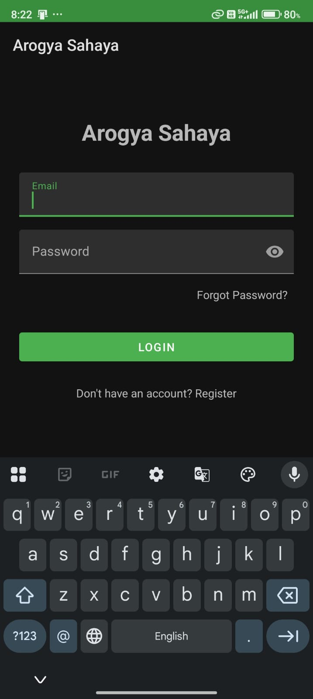
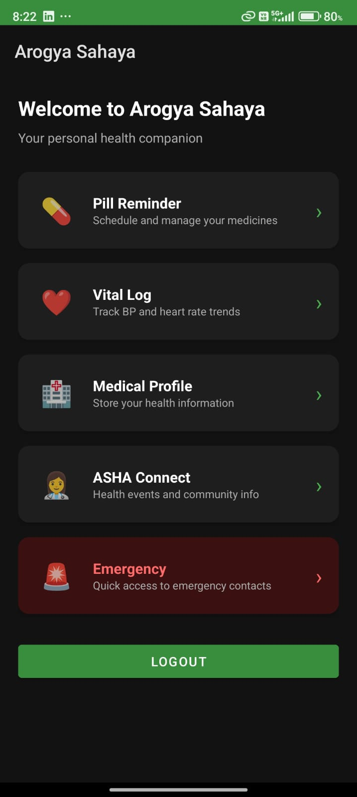
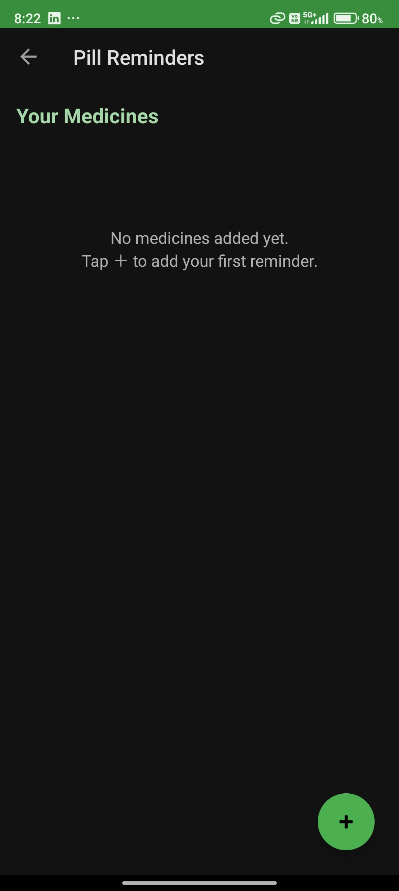

# Arogya Sahaya Local 🏥

**Arogya Sahaya** (Health Help) is a dedicated mobile application designed to empower local communities and rural areas with better health management tools. It bridges the gap between individuals and local health workers (ASHA workers) while providing essential personal health tracking features.

---

## 🚀 Features

- **💊 Pill Reminder**: Never miss a dose. Schedule and manage your medicines with automated reminders using Android WorkManager.
- **❤️ Vital Log**: Track your blood pressure, heart rate, and other vitals over time with intuitive visual charts (powered by MPAndroidChart).
- **👩‍⚕️ ASHA Connect**: Stay updated with local health camps, vaccination drives, and community health events organized by ASHA workers.
- **🏥 Medical Profile**: Securely store your medical history and essential health information for quick reference.
- **🚨 Emergency Access**: Instant access to emergency contacts and nearby medical facilities.
- **☁️ Firebase Integration**: Secure authentication and real-time data synchronization across devices.

---

## 🛠️ Tech Stack

- **Language**: Kotlin
- **UI Framework**: XML with Material Design 3
- **Architecture**: MVVM (Model-View-ViewModel)
- **Database**: Room Persistence Library (Local) & Firebase Firestore (Cloud)
- **Background Tasks**: WorkManager for reliable reminders
- **Charts**: MPAndroidChart for health trends
- **Authentication**: Firebase Auth

---
## 📱 Screenshots

<p align="center">
  
  &nbsp;&nbsp;&nbsp;
  
  &nbsp;&nbsp;&nbsp;
  
</p>

<p align="center">
  <b>Login</b> &nbsp;&nbsp;&nbsp;&nbsp;&nbsp;&nbsp;&nbsp;&nbsp;&nbsp;&nbsp;&nbsp;&nbsp;
  <b>Home Dashboard</b> &nbsp;&nbsp;&nbsp;&nbsp;&nbsp;&nbsp;&nbsp;&nbsp;
  <b>Pill Reminder</b>
</p>
## ⚙️ Installation & Setup

1. **Clone the repository**:
   ```bash
   git clone https://github.com/yourusername/ArogyaSahayaLocal.git
   ```

2. **Firebase Configuration**:
   - Create a project in the [Firebase Console](https://console.firebase.google.com/).
   - Add an Android app with the package name `com.example.arogya_sahayalocal`.
   - Download `google-services.json` and place it in the `app/` directory.

3. **Build & Run**:
   - Open the project in Android Studio.
   - Sync Gradle files.
   - Run the app on an emulator or a physical device.

---

## 🤝 Contributing

Contributions are welcome! If you have suggestions for new features or improvements, feel free to open an issue or submit a pull request.

---

## 📄 License

This project is licensed under the MIT License - see the [LICENSE](LICENSE) file for details.

---

*Developed with ❤️ for a healthier community.*
